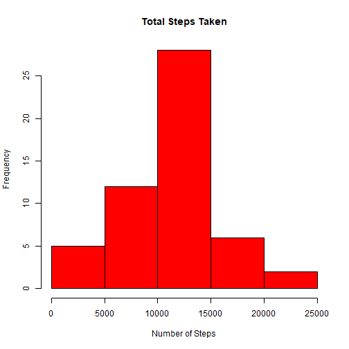
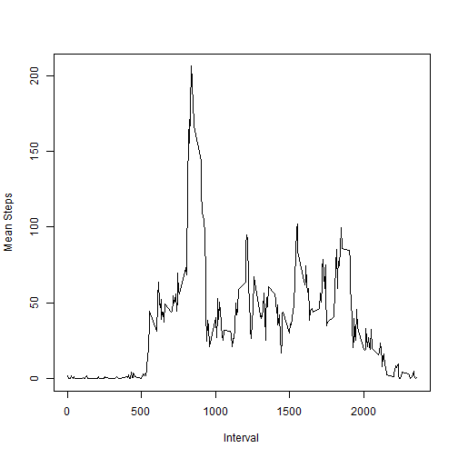
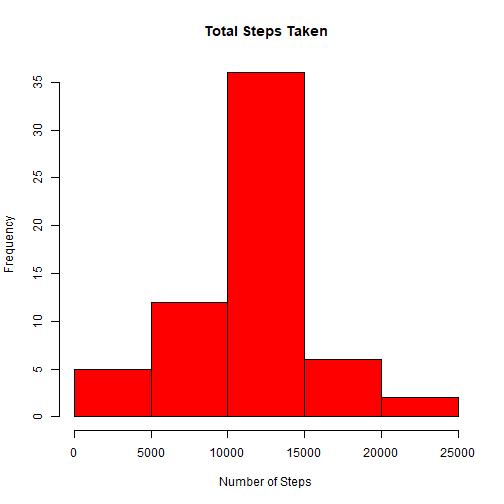
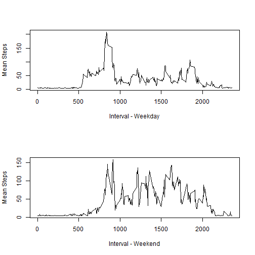

This report looks at activity, specificaly steps taken, at five-minue intervals over the course of two months.  

The following are questions I answered from this data.

What is mean total number of steps taken per day?


```r
knitr::opts_chunk$set(echo = TRUE)
#Set working directory
setwd("~/Richy's Docs/Data Science Course/RepData_PeerAssessment1/RepData_PeerAssessment1_Data")

#Read in data
rawdata <- read.csv("activity.csv")
library(dplyr)
```

```
## Warning: package 'dplyr' was built under R version 3.4.2
```

```
## 
## Attaching package: 'dplyr'
```

```
## The following objects are masked from 'package:stats':
## 
##     filter, lag
```

```
## The following objects are masked from 'package:base':
## 
##     intersect, setdiff, setequal, union
```

```r
dat1 <- filter(rawdata, steps != 'NA')
```

```
## Warning: package 'bindrcpp' was built under R version 3.4.2
```

```r
dat1$date <- as.Date(dat1$date)

#Calculate total steps per day
dat2 <- tapply(dat1$steps, dat1$date, sum)
```
This histogram shows the total number of steps per day.


```r
#Histogram of total steps per day
hist(dat2, col="red", main="Total Steps Taken", xlab="Number of Steps")
```



The following is the average and median number of steps taken per day:

```r
#Mean steps taken per day
mean(dat2, na.rm=TRUE)
```

```
## [1] 10766.19
```

```r
#Median steps taken per day
median(dat2, na.rm=TRUE)
```

```
## [1] 10765
```

What is the average daily activity pattern?

```r
#Time series of number of average steps taken per day
fiveinterval <- dat1 %>% group_by(interval) %>% summarise(mean_steps=mean(steps))
plot(fiveinterval$interval, fiveinterval$mean_steps, type="l", ylab= "Mean Steps", xlab="Interval")
```


Which 5-minute interval, on average across all the days in the dataset, contains the maximum number of steps?

```r
dateinterval <- dat1 %>% group_by(date) %>% summarise(mean_steps=mean(steps))

#Time interval with the maximum number of steps
fiveinterval$interval[which.max(fiveinterval$mean_steps)]
```

```
## [1] 835
```
Imputing missing values
The total number of missing values is 

```r
#count the number of NA's in the raw data
countNA <- unique (unlist (lapply (rawdata, function (x) which (is.na (x)))))
length(countNA)
```

```
## [1] 2304
```

I used the average steps per day (found above) and assigned this value to the missing values.

```r
#Assigning average total steps to each NA value
filldata2 <- rawdata
filldata2$steps[which(is.na(rawdata$steps))] <- mean(filldata2$steps, na.rm=T)
#Calculate total steps per day
dat3 <- tapply(filldata2$steps, filldata2$date, sum)
```
Here is the same information as before, with the missing values now assigned.

```r
#Histogram of total steps per day
hist(dat3, col="red", main="Total Steps Taken", xlab="Number of Steps")
```



```r
#Mean steps taken per day
mean(dat3, na.rm=TRUE)
```

```
## [1] 10766.19
```

```r
#Median steps taken per day
median(dat3, na.rm=TRUE)
```

```
## [1] 10766.19
```
The mean is unchanged from before.  The median increased slightly to be the same as the mean.

Are there differences in activity patterns between weekdays and weekends?

```r
#Creating factor variable for weekends
filldata2$date <- as.Date(filldata2$date)
#create a vector of weekdays
weekdays1 <- c('Monday', 'Tuesday', 'Wednesday', 'Thursday', 'Friday')
#Use `%in%` and `weekdays` to create a logical vector
#convert to `factor` and specify the `levels/labels`
filldata2$wDay <- factor((weekdays(filldata2$date) %in% weekdays1), 
                   levels=c(FALSE, TRUE), labels=c('weekend', 'weekday'))
#Split df by weekend and weekeday
splitdf <- split(filldata2, filldata2$wDay)
#Pull out each dataframe from the list above
weekend <- splitdf[[1]]
weekday <- splitdf[[2]]
#Average steps per weekday
wkdayinterval <- weekday %>% group_by(interval) %>% summarise(mean_steps=mean(steps))
#Average steps per weekend
wknddayinterval <- weekend %>% group_by(interval) %>% summarise(mean_steps=mean(steps))
```
Here is a panel plot showing the weekday and weekend mean steps by interval.

```r
#plotting the weekday and weekend mean steps by interval
par(mfrow=c(2,1))
plot(wkdayinterval$interval, wkdayinterval$mean_steps, type="l", 
     ylab= "Mean Steps", xlab="Interval - Weekday")
plot(wknddayinterval$interval, wknddayinterval$mean_steps, type="l", 
     ylab= "Mean Steps", xlab="Interval - Weekend")
```



